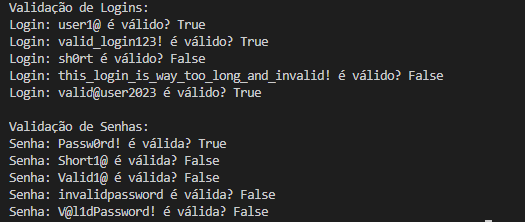

# Validador de Login e Senha

Este script em Python valida logins e senhas usando  `expressões regulares `.

## Critérios de Validação Aplicados

### Login

- Entre 5 e 30 caracteres.
- Pelo menos uma letra, um número e um caractere especial.

### Senha

- Entre 8 e 12 caracteres.
- Pelo menos uma letra maiúscula, uma minúscula, um número e um caractere especial.

## Uso

### Requisitos

- Python 3.x instalado.

### Execução

 ```bash 
 python3 regex_validation.py  
 ``` 
 
# Resultado 
