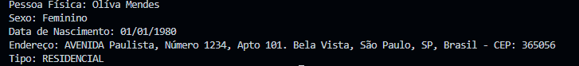
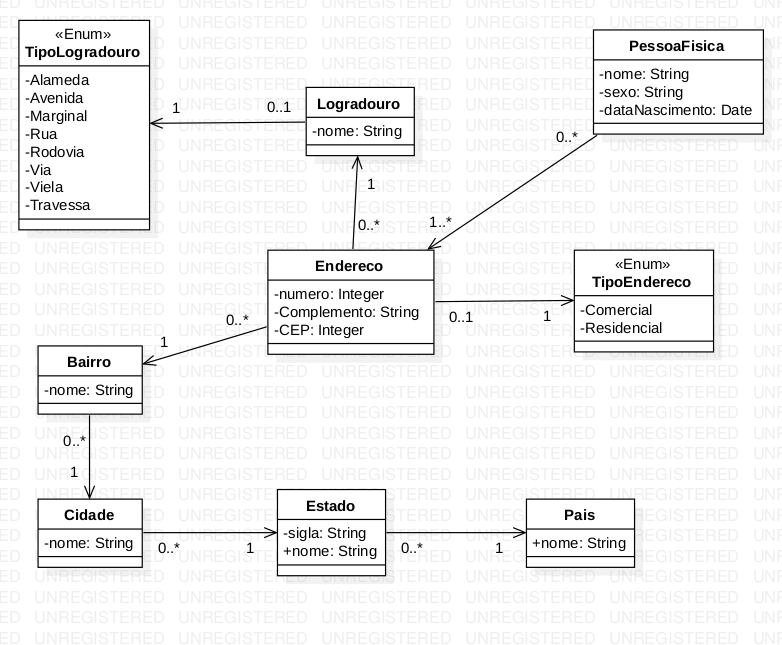

# Atividade de Sistema de Endereçamento em Java

Esta atividade de programação envolve a implementação de um conjunto de classes em Java que modelam um sistema de endereçamento. O código cria uma estrutura que pode representar endereços físicos, com detalhes sobre logradouros, bairros, cidades, estados e países, bem como informações sobre pessoas físicas associadas a esses endereços.

A atividade foi projetada para praticar os seguintes conceitos em Java:

- Definição de classes e enumerações.
- Associação entre classes.
- Uso de construtores para criar objetos.

## Classes e Enumerações

- `PessoaFisica`: Armazena informações de uma pessoa, como nome, sexo e data de nascimento.
- `Endereco`: Mantém detalhes de um endereço, incluindo logradouro, número, complemento e CEP.
- `Logradouro`: Define um logradouro e seu tipo (rua, avenida, etc.).
- `Bairro`, `Cidade`, `Estado`, `País`: Representam as várias divisões geográficas de um endereço.
- `TipoLogradouro` e `TipoEndereco`: Enumerações que categorizam os tipos de logradouros e endereços.

## Pré-requisitos

É necessário ter o JDK (Java Development Kit) versão 8 ou superior para compilar e executar a atividade.

## Execução

Para compilar e executar, navegue até a pasta `endereco` e depois para a subpasta `src`. No terminal, execute os seguintes comandos:

```bash
javac Main.java
java Main
```

Isso compilará as classes e executará o programa principal, que criará instâncias de todas as classes e exibirá as informações de uma `PessoaFisica`.

## Exemplo de Saída
Quando executado, o programa irá imprimir detalhes da pessoa física, incluindo o nome, sexo, data de nascimento e endereço completo. Aqui está um exemplo de como a saída pode parecer:



## Diagrama 

*Diagrama disponibilizado pelo professor para realização da atividade.* 